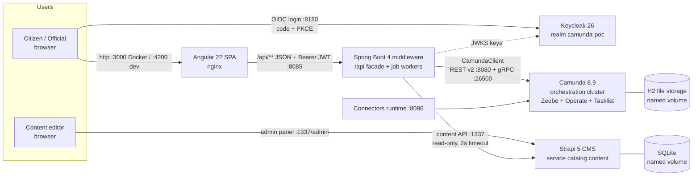

# camunda8-angular-poc

Learning POC: **Camunda 8.9** (process orchestration) + **Spring Boot 4** middleware + **Angular 22** frontend, as an AI-friendly, spec-first monorepo. Sibling project to `cib7-react-poc` (CIB seven + React) — same idea, next-generation engine.

## Quick start

```bash
docker compose up --build -d
```

| URL | What | Login |
|---|---|---|
| **http://localhost:3000** | **The POC frontend — open this one** (Services / Tasks / Processes) | bart / bart (applicant) or homer / homer (civil servant) |
| http://localhost:8080/operate | Camunda Operate (instances, diagrams, decisions) | demo / demo |
| http://localhost:8080/tasklist | Camunda Tasklist (bundled) | demo / demo |
| http://localhost:8085/api | Backend REST facade — JSON API only, not a web page; every response is `401` without a Keycloak JWT | see curl recipe below |
| http://localhost:8180 | Keycloak admin console (realm `camunda-poc`) | admin / admin |
| http://localhost:1337/admin | Strapi CMS admin (edit service catalog content) | admin@poc.local / PocAdmin1234! (self-registered — see Default users) |
| http://localhost:4200 | Frontend in dev mode — **only up while `npm start` is running** (see Development below); with the Docker stack use :3000 | same as :3000 |

### Default users (POC only — never reuse anywhere)

| Username | Password | Where | Role / purpose |
|---|---|---|---|
| `bart` | `bart` | Frontend (:3000 / :4200) | `applicant` — fills and submits start forms |
| `homer` | `homer` | Frontend (:3000 / :4200) | `civil-servant` — reviews and completes user tasks |
| `demo` | `demo` | Camunda Operate + Tasklist (:8080) | Cluster webapp login (Camunda dev-mode seed user) |
| `admin` | `admin` | Keycloak admin console (:8180) | Manage the `camunda-poc` realm, users, and roles |
| `admin@poc.local` | `PocAdmin1234!` | Strapi admin panel (:1337/admin) | Edit service catalog content. **Not seeded** — self-registered on first visit and stored only in the Strapi volume; these are the credentials registered in the current dev volume. After `docker compose down -v` the panel asks for a fresh registration (pick any credentials). |

There is no Cockpit in Camunda 8 — **Operate** (:8080/operate) is its closest equivalent.

## What it does

Two BPMN processes run on Camunda 8 and are startable from the frontend:

- **Vehicle registration** — start form → `fetch-vehicle-price` job worker (hardcoded price map) → review user task → Registered/Rejected
- **Business registration** — start form → **DMN decision** `business-auto-approval` (capital ≥ 2500 ∧ adult → auto-approve) → auto-Registered, or manual review → Registered/Rejected

User task forms are **Camunda Forms** (`.form` files deployed with the BPMN), rendered in Angular with `@bpmn-io/form-js-viewer`. The frontend talks only to the Spring Boot middleware (`/api/**`), which talks to Camunda via `CamundaClient` (Orchestration Cluster REST API v2).

The Services page shows **editorial content from Strapi** (title, summary, instructions, expected duration) merged with the deployed process definitions by the backend (`GET /api/services`, joined on the BPMN process id). Content is seeded automatically on first boot; if Strapi is down the catalog degrades to raw engine data and stays fully functional.

## Architecture



Who owns what: **Camunda** runs the executable artifacts (BPMN, DMN, Camunda Forms — deployed from `backend/src/main/resources/processes/` at startup); **Strapi** holds the editorial catalog copy (title, summary, instructions), joined by the backend on the BPMN process id at read time; **Keycloak** authenticates users and issues the roles the backend enforces. The browser only ever talks to the frontend, Keycloak, and (for editors) the Strapi admin panel — all business calls go through the `/api` facade. Details and trade-offs: [docs/architecture.md](docs/architecture.md).

## Repo layout

| Folder | Purpose |
|---|---|
| `openspec/` | OpenSpec spec-first workflow (capability specs + change proposals) |
| `docs/` | Architecture + per-service business specs (analyst-owned source of truth) |
| `backend/` | Spring Boot 4 middleware; processes in `src/main/resources/processes/` auto-deploy at startup |
| `frontend/` | Angular 22 SPA (form-js task forms) |
| `cms/` | Strapi 5 CMS — editorial service-catalog content (`service` collection type, seeded on first boot) |
| `docker/camunda/` | Orchestration cluster config (H2, dev security posture) |
| `docker/keycloak/` | Keycloak realm export (roles, demo users, SPA client) |

## Development

```bash
# cluster + Keycloak + CMS in Docker, apps local with hot reload
docker compose up -d orchestration connectors keycloak strapi
cd backend && ./mvnw spring-boot:run    # JDK 21+, http://localhost:8085
cd frontend && npm start                # Node >= 22.22.3, http://localhost:4200
```

### Calling the API with curl (dev-only recipe)

`/api/**` requires a bearer token. The SPA client allows the password grant purely as a dev convenience:

```bash
TOKEN=$(curl -s -X POST http://localhost:8180/realms/camunda-poc/protocol/openid-connect/token \
  -d "grant_type=password&client_id=poc-frontend&username=bart&password=bart" | jq -r .access_token)
curl -H "Authorization: Bearer $TOKEN" http://localhost:8085/api/process-definitions
```

Use `homer`/`homer` for a `civil-servant` token (task completion). Role rules: `POST .../start` needs `applicant`, `POST .../complete` needs `civil-servant`, reads need any valid token.

Author BPMN/DMN/forms with [Camunda Desktop Modeler](https://camunda.com/download/modeler/); files live in `backend/src/main/resources/processes/<service>/` and redeploy on backend restart. Business-level specs (flows, fields, decision tables) live in `docs/business/services/` — keep them in sync with the process files.

### Editing catalog content (Strapi)

Open http://localhost:1337/admin — the first visit asks you to register a local admin account (any credentials; it is stored in Strapi's own SQLite volume). Edit an entry under **Content Manager → Service**, hit **Publish**, and reload the Services page: the new copy appears immediately, no redeploy. Content survives `docker compose down`/restart; `docker compose down -v` wipes it, after which the bootstrap hook re-seeds the two default entries from `cms/src/data/seed-services.json`.

## Deliberate POC trade-offs

Frontend + `/api` are secured via Keycloak (OIDC code + PKCE, realm auto-imported), but Keycloak itself runs in dev mode over plain http with demo credentials, the Camunda cluster API stays unprotected (dev mode, `demo`/`demo` UIs), storage is single-node H2, and there is no HTTPS. See `docs/architecture.md`.
