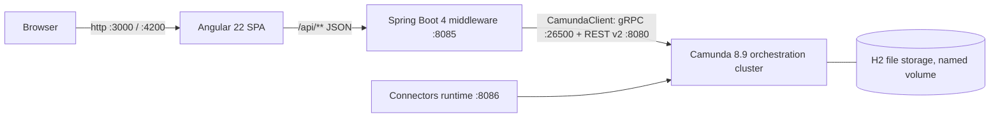

# Architecture

> **When to read this:** you need the big picture — what runs where, which ports, how a request travels, and which trade-offs were accepted. For process-level business detail see `docs/business/services/`. For the change workflow see `openspec/`.

## Components

| Component | Tech | Responsibility |
|---|---|---|
| `frontend/` | Angular 22, `@bpmn-io/form-js-viewer` | Services catalog, task list, Camunda Form rendering, process overview. Talks **only** to the backend. |
| `backend/` | Spring Boot 4.0.x, Java 21, `io.camunda:camunda-spring-boot-starter` 8.9.x | Auto-deploys BPMN/DMN/forms at startup, hosts `@JobWorker`s, exposes the thin `/api` facade over the Orchestration Cluster REST API v2. |
| orchestration cluster | `camunda/camunda:8.9.x` (single image: Zeebe + Operate + Tasklist + Identity) | Executes BPMN/DMN (FEEL engine), manages user tasks, bundled UIs at `/operate` and `/tasklist`. H2 secondary storage — **no Elasticsearch**. |
| connectors | `camunda/connectors-bundle` | Present for later experiments; the two POC processes use plain job workers. |

## Request flow (happy path)

1. SPA loads process catalog: `GET /api/process-definitions` → backend → `POST /v2/process-definitions/search`.
2. User starts a service: SPA fetches the start form schema, renders it with form-js, posts values to `POST /api/process-definitions/{key}/start` → backend → `POST /v2/process-instances`.
3. Zeebe runs the flow; service tasks are pulled by backend `@JobWorker`s over gRPC; DMN decisions evaluate inside Zeebe.
4. A user task appears: `GET /api/tasks` (→ `/v2/user-tasks/search`), detail + form schema via `GET /api/tasks/{key}` (→ `/v2/user-tasks/{key}/form` + variables).
5. SPA submits the form: `POST /api/tasks/{key}/complete` → `/v2/user-tasks/{key}/completion`. Instance advances to an end event; result visible in Operate and on the Processes page.

## Ports

| Port | What |
|---|---|
| 3000 | Frontend (nginx, Docker) — proxies `/api` → backend |
| 4200 | Frontend dev (`ng serve`) — proxies `/api` → 8085 |
| 8085 | Backend `/api` |
| 8080 | Orchestration cluster: REST API v2 + Operate (`/operate`) + Tasklist (`/tasklist`) |
| 26500 | Zeebe gRPC gateway |
| 8086 | Connectors runtime |
| 9600 | Cluster management/actuator |

## Topologies

- **Dev:** `docker compose up` (cluster + connectors only) + `./mvnw spring-boot:run` in `backend/` + `npm start` in `frontend/`.
- **Docker (end state):** `docker compose up --build` runs everything; backend reaches the cluster via service DNS (`orchestration:26500` / `orchestration:8080`); browser uses same-origin `/api` through nginx — no CORS anywhere.

## Security posture (deliberate POC trade-offs)

- Camunda dev mode: `authentication.method: basic`, **`unprotectedApi: true`**, authorizations disabled. UIs seeded with `demo`/`demo`. The API is open on localhost — POC only.
- No frontend login, no task assignment semantics ("my tasks" = all tasks).
- Planned future change: Keycloak OIDC (cluster `authentication.method: oidc`, Angular login, JWT via backend) — mirrors what `cib7-react-poc` does today.

## Conventions (AI guidance)

- Spec-first: analyst-owned markdown in `docs/business/services/<service>/` is the source of truth for process content; OpenSpec (`openspec/`) governs changes (proposal → specs → tasks → archive).
- Process resources live in `backend/src/main/resources/processes/<service>/` — one folder per service: `<service>.bpmn`, `*.dmn`, `*.form`.
- Ids are kebab-case everywhere (process ids, job types, form ids, decision ids). Process variables are camelCase.
- Orchestration Cluster REST API **v2 only** — never the deprecated v1 Tasklist/Operate APIs (removed in 8.10).
- User tasks are **Camunda user tasks** (`zeebe:userTask`, Modeler default) with **linked Camunda Forms** — required for `/v2/user-tasks` management.
- DMN calls use `bindingType="deployment"` so decision versions travel with their BPMN.
