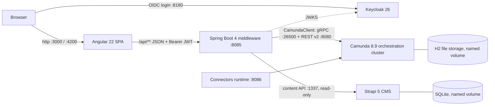

# Architecture

> **When to read this:** you need the big picture — what runs where, which ports, how a request travels, and which trade-offs were accepted. For process-level business detail see `docs/business/services/`. For the change workflow see `openspec/`.

## Components

| Component | Tech | Responsibility |
|---|---|---|
| `frontend/` | Angular 22, `@bpmn-io/form-js-viewer` | Services catalog, task list, Camunda Form rendering, process overview. Talks **only** to the backend. |
| `backend/` | Spring Boot 4.0.x, Java 21, `io.camunda:camunda-spring-boot-starter` 8.9.x | Auto-deploys BPMN/DMN/forms at startup, hosts `@JobWorker`s, exposes the thin `/api` facade over the Orchestration Cluster REST API v2. Protocol note: the 8.9 client defaults to `prefer-rest-over-grpc=true`, so effectively all traffic uses REST (8080); gRPC (26500) is configured but only used by gRPC-only features such as job *streaming* (our workers poll). |
| orchestration cluster | `camunda/camunda:8.9.x` (single image: Zeebe + Operate + Tasklist + Identity) | Executes BPMN/DMN (FEEL engine), manages user tasks, bundled UIs at `/operate` and `/tasklist`. H2 secondary storage — **no Elasticsearch**. |
| connectors | `camunda/connectors-bundle` | Present for later experiments; the two POC processes use plain job workers. |
| keycloak | `quay.io/keycloak/keycloak:26.1`, dev mode | Identity provider. Realm `camunda-poc` auto-imported from `docker/keycloak/realm-export.json`: roles `applicant`/`civil-servant`, demo users `bart`/`bart` and `homer`/`homer`, public PKCE client `poc-frontend`. |
| `cms/` | Strapi 5 (SQLite) | Headless CMS for editorial service-catalog content (`service` collection type: title, summary, instructions, whatYouNeed, expectedDuration). A bootstrap hook grants public read and seeds both services from `cms/src/data/seed-services.json` when empty. Editors use the Strapi admin panel (`:1337/admin`). |

## Request flow (happy path)

0. Unauthenticated visitor is redirected to Keycloak (`login-required`, Authorization Code + PKCE). After login the SPA holds an access token; an HTTP interceptor attaches it as `Authorization: Bearer` to every `/api` call, and the backend (OAuth2 resource server) validates it.
1. SPA loads the service catalog: `GET /api/services` → backend joins `POST /v2/process-definitions/search` (latest versions) with Strapi's published `service` entries on `processDefinitionId`. Strapi down or entry missing ⇒ the item degrades to engine-only fields (content fields null); the raw engine view stays available at `GET /api/process-definitions`.
2. User starts a service: SPA fetches the start form schema, renders it with form-js, posts values to `POST /api/process-definitions/{key}/start` → backend → `POST /v2/process-instances`.
3. Zeebe runs the flow; service tasks are pulled by backend `@JobWorker`s over gRPC; DMN decisions evaluate inside Zeebe.
4. A user task appears: `GET /api/tasks` (→ `/v2/user-tasks/search`), detail + form schema via `GET /api/tasks/{key}` (→ `/v2/user-tasks/{key}/form` + variables).
5. SPA submits the form: `POST /api/tasks/{key}/complete` → `/v2/user-tasks/{key}/completion`. Instance advances to an end event; result visible in Operate and on the Processes page.

## Ports

| Port | What |
|---|---|
| 3000 | Frontend (nginx, Docker) — proxies `/api` → backend |
| 4200 | Frontend dev (`ng serve`) — proxies `/api` → 8085 |
| 8085 | Backend `/api` |
| 8080 | Orchestration cluster: REST API v2 + Operate (`/operate`) + Tasklist (`/tasklist`) |
| 26500 | Zeebe gRPC gateway |
| 8086 | Connectors runtime |
| 8180 | Keycloak (admin console + realm endpoints) |
| 1337 | Strapi CMS (admin panel `/admin` + content API `/api/services`) |
| 9600 | Cluster management/actuator |

## Topologies

- **Dev:** `docker compose up -d orchestration connectors keycloak strapi` + `./mvnw spring-boot:run` in `backend/` + `npm start` in `frontend/`.
- **Docker (end state):** `docker compose up --build` runs everything; backend reaches the cluster via service DNS (`orchestration:26500` / `orchestration:8080`); browser uses same-origin `/api` through nginx — no CORS for business calls (the SPA↔Keycloak calls are cross-origin by design, covered by the client's web origins).

## Token flow (browser vs. containers)

Keycloak is pinned to one canonical issuer, `http://localhost:8180` (`KC_HOSTNAME_URL`), so every token carries `iss=http://localhost:8180/realms/camunda-poc` no matter where it is inspected. The SPA always talks to Keycloak at that URL. The backend splits validation in two: signing keys are fetched from a *reachable* JWKS URL (`http://keycloak:8080/...` via service DNS in Docker, `http://localhost:8180/...` locally — `KEYCLOAK_JWKS_URI` env), while the `iss` claim is string-compared against the canonical public URL (`KEYCLOAK_ISSUER`). Keycloak deliberately stays on its own published port rather than behind the nginx proxy — moving it would change the issuer baked into JWTs.

## Content ownership boundary

Camunda owns everything *executable* — BPMN, DMN, form schemas — versioned by deployment (`bindingType="deployment"`). Strapi owns everything *editorial* — citizen-facing catalog copy — published on an editorial cadence, no redeploy. The two sides are joined at read time by the backend on `processDefinitionId` (the stable BPMN process id; numeric definition keys change every deployment). There is no sync or webhook between them: an orphaned CMS entry is simply not shown, a deployed process without content renders from engine data.

## Security posture (deliberate POC trade-offs)

- Frontend login via Keycloak (OIDC Authorization Code + PKCE, `login-required`); `/api/**` requires a valid JWT. Roles: `applicant` starts processes, `civil-servant` completes user tasks, reads for any authenticated user (rules in `backend/.../security/SecurityConfig.java`).
- Keycloak runs in **dev mode** over plain http with `admin`/`admin` bootstrap and password-grant enabled on the SPA client (curl convenience) — none of this is production-grade.
- Camunda dev mode: `authentication.method: basic`, **`unprotectedApi: true`**, authorizations disabled. UIs seeded with `demo`/`demo`. The cluster API is open on localhost — POC only; securing the cluster itself (OIDC identity) is a possible later change.
- No task *assignment* semantics: any civil servant sees all tasks ("my tasks" = all tasks); BPMN-level candidate groups are a later learning step.
- Strapi: the `service` content type is world-readable on :1337 (`find`/`findOne` on the public role — catalog copy is public by nature) and its secrets in `docker-compose.yml` are POC dummies. Writes and the admin panel use Strapi's own auth (no Keycloak SSO). Production hardening would mean an API token + keeping 1337 network-internal.

## Conventions (AI guidance)

- Spec-first: analyst-owned markdown in `docs/business/services/<service>/` is the source of truth for process content; OpenSpec (`openspec/`) governs changes (proposal → specs → tasks → archive).
- Process resources live in `backend/src/main/resources/processes/<service>/` — one folder per service: `<service>.bpmn`, `*.dmn`, `*.form`.
- Ids are kebab-case everywhere (process ids, job types, form ids, decision ids). Process variables are camelCase.
- Orchestration Cluster REST API **v2 only** — never the deprecated v1 Tasklist/Operate APIs (removed in 8.10).
- User tasks are **Camunda user tasks** (`zeebe:userTask`, Modeler default) with **linked Camunda Forms** — required for `/v2/user-tasks` management.
- DMN calls use `bindingType="deployment"` so decision versions travel with their BPMN.
