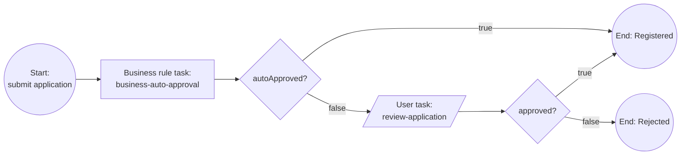

# Business registration (simplified)

> **When to read this:** you are implementing, changing, or generating artifacts for the `business-registration` process. This markdown is the source of truth for the process content; executable requirements live in `openspec/`.

A founder registers a company (Estonian OÜ, heavily simplified). A DMN decision auto-approves clear-cut cases; the rest go to manual review. Learning goals on top of vehicle-registration: business rule task, DMN decision table, FEEL, multi-path gateways.

## Flow

| Element | Type | Id | Notes |
|---|---|---|---|
| Submit application | Start event + linked form | form `business-registration-start` | Company name, share capital, founder age |
| Auto-approval decision | Business rule task | decision `business-auto-approval`, `bindingType="deployment"`, result variable `autoApproved` | Evaluated by Zeebe's DMN engine |
| autoApproved? | Exclusive gateway | — | `= autoApproved` → Registered; default → review |
| Review application | User task (Camunda user task) + linked form | task `review-application`, form `review-application` | Manual approve/reject |
| approved? | Exclusive gateway | — | `= approved` → Registered; default → Rejected |
| Registered / Rejected | End events | — | Registered is shared by both paths |

- **Process id:** `business-registration` (files in `backend/src/main/resources/processes/business-registration/`)
- **Forms:** [forms/business-registration-start.md](forms/business-registration-start.md), [forms/review-application.md](forms/review-application.md)
- **Decision:** [decisions/business-auto-approval.md](decisions/business-auto-approval.md)

## Process variables

| Variable | Type | Set by | Meaning |
|---|---|---|---|
| `companyName` | string | start form | Proposed company name |
| `shareCapital` | number | start form | Share capital in EUR |
| `founderAge` | number | start form | Founder's age in years |
| `autoApproved` | boolean | DMN decision | Clear-cut case → skip review |
| `approved` | boolean | review form | Reviewer decision (manual path only) |

## Roles / authorization

Keycloak realm roles (realm `camunda-poc`, see `docker/keycloak/realm-export.json`):

| Role | Who | May do |
|---|---|---|
| `applicant` | citizen (demo user `bart`) | Start the process (submit application form) |
| `civil-servant` | official (demo user `homer`) | Complete the `review-application` user task (manual path) |

Any authenticated user may read process/task lists. Enforced by the backend (`SecurityConfig`) and mirrored in the frontend nav/route guards. The DMN auto-approval path involves no human role at all.

## Catalog content (Strapi)

Citizen-facing copy shown on the Services page and start page, owned by editors in the Strapi CMS (`service` entry joined on process id `business-registration`). This table is the source of truth for the *seeded defaults* (`cms/src/data/seed-services.json`); editors may change the live copy in the admin panel without touching the repo.

| Field | Seeded value |
|---|---|
| `title` | Business registration |
| `summary` | Register a new company (OU). Clear-cut applications are approved automatically; the rest are reviewed by an official. |
| `instructions` | Fill in the company name, share capital, and founder details and submit the application. Clear-cut cases are approved instantly by an automated decision; other applications go to manual review by an official. |
| `whatYouNeed` | Proposed company name; planned share capital in EUR; founder's age |
| `expectedDuration` | Instant for clear-cut cases, otherwise 1-2 working days |

Arabic (`ar`) seeded values (developer-written, pending native-speaker review; source `cms/src/data/seed-services.ar.json`):

| Field | Seeded value (ar) |
|---|---|
| `title` | تسجيل شركة |
| `summary` | سجّل شركة جديدة (OÜ). تُعتمد الطلبات الواضحة تلقائيًا، ويراجع موظف رسمي بقية الطلبات. |
| `instructions` | املأ اسم الشركة ورأس المال وبيانات المؤسس ثم أرسل الطلب. تُعتمد الحالات الواضحة فورًا بقرار آلي، وتُحال الطلبات الأخرى إلى مراجعة يدوية من موظف رسمي. |
| `whatYouNeed` | اسم الشركة المقترح؛ رأس المال المخطط له باليورو؛ عمر المؤسس |
| `expectedDuration` | فوري للحالات الواضحة، وإلا 1–2 يوم عمل |

Arabic form labels for `business-registration-start` and `review-application` are seeded in `cms/src/data/seed-form-translations.json` (Strapi `form-translation` entries) — the deployed `.form` files stay English-only.

## Known trade-offs

- One founder only (cib7's board members / founder-signature loop dropped on purpose).
- No send-back-to-applicant loop; reject is terminal.
- No company-name uniqueness check (no registry integration).

## LLM guidance

- The DMN deploys from the same resource folder and MUST be referenced with `bindingType="deployment"` — decision version travels with the BPMN.
- Result variable of the business rule task is `autoApproved` (`resultVariable="autoApproved"`); the decision output name is also `autoApproved` — keep them aligned.
- Both gateways use FEEL condition `= autoApproved` / `= approved` on the true edge and a default flow otherwise.
- Auto-approved instances MUST NOT create any user task — verify in Operate that the token goes straight to Registered.
- Changing the decision logic? Update [decisions/business-auto-approval.md](decisions/business-auto-approval.md) and the `.dmn` together; the markdown table and the decision table rows must match 1:1.
