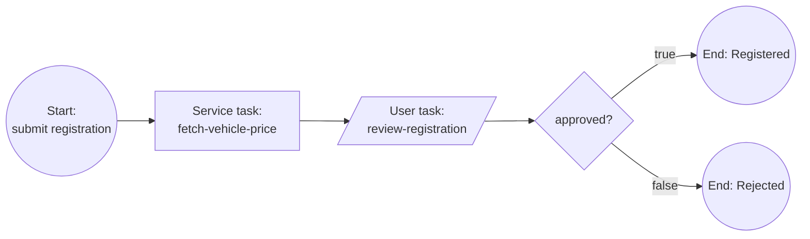

# Vehicle registration (simplified)

> **When to read this:** you are implementing, changing, or generating artifacts for the `vehicle-registration` process. This markdown is the source of truth for the process content; executable requirements live in `openspec/`.

A citizen registers a vehicle. The system looks up the registration price automatically; a reviewer approves or rejects the registration. Deliberately minimal — the learning goals are: start form, job worker, user task with linked Camunda Form, exclusive gateway.

## Flow

| Element | Type | Id / job type | Notes |
|---|---|---|---|
| Submit registration | Start event + linked form | form `vehicle-registration-start` | Collects owner + vehicle data |
| Fetch vehicle price | Service task | job type `fetch-vehicle-price` | Backend `@JobWorker`, hardcoded category→price map, writes `price` |
| Review registration | User task (Camunda user task) + linked form | task `review-registration`, form `review-registration` | Shows submitted data + price; reviewer sets `approved` |
| approved? | Exclusive gateway | — | Condition `= approved` / else |
| Registered / Rejected | End events | — | |

- **Process id:** `vehicle-registration` (BPMN file `backend/src/main/resources/processes/vehicle-registration/vehicle-registration.bpmn`)
- **Forms:** [forms/vehicle-registration-start.md](forms/vehicle-registration-start.md), [forms/review-registration.md](forms/review-registration.md)

## Process variables

| Variable | Type | Set by | Meaning |
|---|---|---|---|
| `ownerName` | string | start form | Vehicle owner's full name |
| `vin` | string | start form | Vehicle identification number |
| `category` | string | start form | `car` \| `motorcycle` \| `truck` |
| `price` | number | `fetch-vehicle-price` worker | Registration fee in EUR |
| `approved` | boolean | review form | Reviewer decision |

## Price lookup (worker behavior)

Hardcoded map in the backend worker — `car` → 150, `motorcycle` → 80, `truck` → 250, anything else → 100. No external calls.

## Roles / authorization

Keycloak realm roles (realm `camunda-poc`, see `docker/keycloak/realm-export.json`):

| Role | Who | May do |
|---|---|---|
| `applicant` | citizen (demo user `bart`) | Start the process (submit registration form) |
| `civil-servant` | official (demo user `homer`) | Complete the `review-registration` user task |

Any authenticated user may read process/task lists. Enforced by the backend (`SecurityConfig`) and mirrored in the frontend nav/route guards. No task assignment yet — every civil servant sees every open review task.

## Catalog content (Strapi)

Citizen-facing copy shown on the Services page and start page, owned by editors in the Strapi CMS (`service` entry joined on process id `vehicle-registration`). This table is the source of truth for the *seeded defaults* (`cms/src/data/seed-services.json`); editors may change the live copy in the admin panel without touching the repo.

| Field | Seeded value |
|---|---|
| `title` | Vehicle registration |
| `summary` | Register a car, motorcycle, or truck in your name. The registration fee is calculated automatically and an official reviews your application. |
| `instructions` | Fill in the owner and vehicle details and submit the application. The registration fee is determined automatically from the vehicle category. An official then reviews your application and you will see the outcome under My processes. |
| `whatYouNeed` | Vehicle identification number (VIN); vehicle category (car, motorcycle, or truck); your full name as the owner |
| `expectedDuration` | 1-2 working days (fee: 80-250 EUR depending on category) |

Arabic (`ar`) seeded values (developer-written, pending native-speaker review; source `cms/src/data/seed-services.ar.json`):

| Field | Seeded value (ar) |
|---|---|
| `title` | تسجيل مركبة |
| `summary` | سجّل سيارة أو دراجة نارية أو شاحنة باسمك. تُحسب رسوم التسجيل تلقائيًا ويراجع موظف رسمي طلبك. |
| `instructions` | املأ بيانات المالك والمركبة ثم أرسل الطلب. تُحدَّد رسوم التسجيل تلقائيًا حسب فئة المركبة. بعد ذلك يراجع موظف رسمي طلبك وسترى النتيجة ضمن «عملياتي». |
| `whatYouNeed` | رقم تعريف المركبة (VIN)؛ فئة المركبة (سيارة أو دراجة نارية أو شاحنة)؛ اسمك الكامل بصفتك المالك |
| `expectedDuration` | 1–2 يوم عمل (الرسوم: 80–250 يورو حسب الفئة) |

Arabic form labels for `vehicle-registration-start` and `review-registration` are seeded in `cms/src/data/seed-form-translations.json` (Strapi `form-translation` entries) — the deployed `.form` files stay English-only.

## Known trade-offs

- Reviewer sees no vehicle registry data (no external lookup like cib7's Liiklusregister stub) — price map stands in for "integration".
- Reject ends the process; no send-back loop (business-registration keeps it simple too; loops are a later learning step).

## LLM guidance

- Keep the BPMN a single pool, no lanes, left-to-right layout.
- The user task MUST be a Camunda user task (`zeebe:userTask`) with a **linked** Camunda Form (not embedded formKey) so `/v2/user-tasks/{key}/form` returns the schema.
- Gateway conditions in FEEL: `= approved` on the true edge; default flow to Rejected.
- Changing fields? Update the form spec md + this variables table + the `.form` file + any worker/`@Variable` bindings together.
